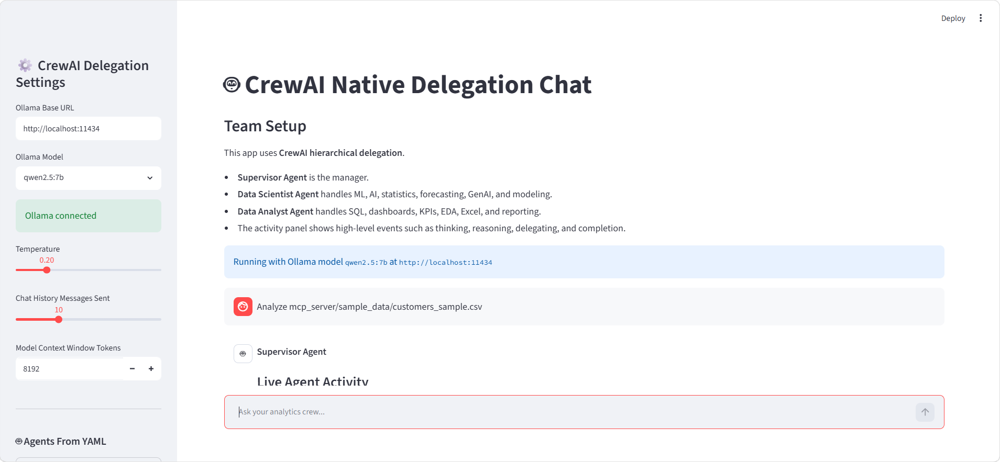
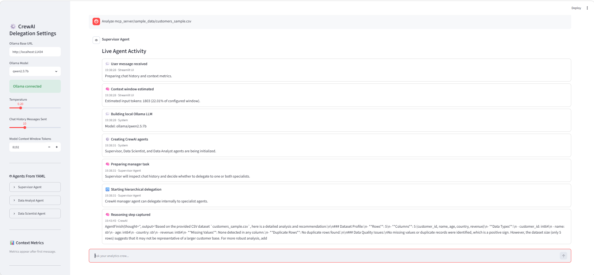
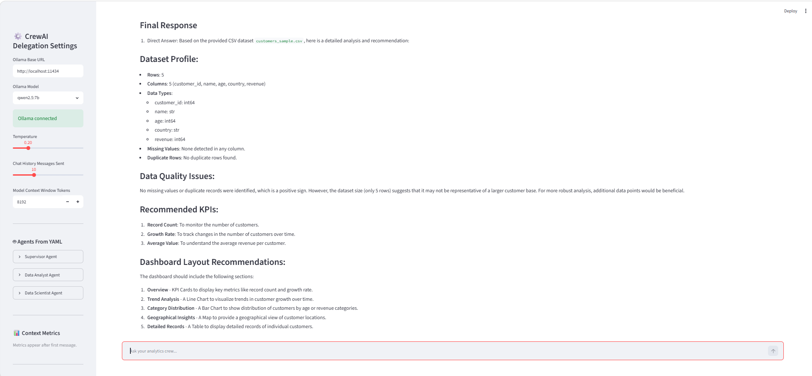

# 🤖 CrewAI Analytics Assistant using Ollama & MCP

A **Multi-Agent AI Analytics Assistant** built using **CrewAI**, **Ollama**, **Model Context Protocol (MCP)**, and **Streamlit**.

The application leverages a **hierarchical multi-agent architecture** where a **Supervisor Agent** intelligently delegates user requests to specialized **Data Analyst** and **Data Scientist** agents. It provides conversational analytics capabilities including dataset profiling, SQL validation, KPI recommendations, dashboard suggestions, and machine learning planning using locally hosted LLMs.

---

## 🚀 Features

- Multi-Agent AI system using CrewAI
- Hierarchical agent delegation
- Local LLM inference using Ollama
- Interactive Streamlit chat interface
- Model Context Protocol (MCP) integration
- CSV dataset profiling
- SQL query validation
- Data quality assessment
- KPI recommendation
- Dashboard layout suggestion
- Machine learning problem recommendation
- Feature engineering suggestions
- ML evaluation metric recommendation
- End-to-end ML pipeline planning

---

# 🏗️ System Architecture

```
                     User
                       │
                       ▼
              Streamlit Interface
                       │
                       ▼
              Supervisor Agent
                       │
        ┌──────────────┴──────────────┐
        ▼                             ▼
 Data Analyst Agent          Data Scientist Agent
        │                             │
        └──────────────┬──────────────┘
                       ▼
              Function Tools Layer
                       │
                       ▼
                 MCP Server
                       │
     ┌───────────┬────────────┬─────────────┐
     ▼           ▼            ▼             ▼
 CSV Tools   SQL Tools   KPI Tools    ML Tools
```

---

# 📂 Project Structure

```
crewai-analytics-assistant/
│
├── agents/
│
├── config/
│
├── function_tools/
│
├── mcp_server/
│   ├── sample_data/
│   └── tools/
│
├── screenshots/
│   ├── home.png
│   ├── delegation.png
│   └── final_response.png
│
├── tests/
│   ├── test_analyst.py
│   ├── test_csv_profile.py
│   ├── test_data_quality.py
│   ├── test_crew_tools.py
│   ├── test_scientist.py
│   ├── test_sql.py
│   └── test_supervisor.py
│
├── app.py
├── requirements.txt
├── README.md
└── .gitignore
```

---

# 🛠️ Tech Stack

### Languages

- Python

### AI Frameworks

- CrewAI
- Ollama

### Protocol

- Model Context Protocol (MCP)

### Data & Analytics

- Pandas
- DuckDB
- SQL

### UI

- Streamlit

### Configuration

- YAML

---

# 👥 Agent Responsibilities

## 🧠 Supervisor Agent

Responsible for:

- Understanding user intent
- Delegating tasks to specialist agents
- Coordinating execution
- Validating outputs
- Returning the final response

---

## 📊 Data Analyst Agent

Responsible for:

- CSV Profiling
- Data Quality Analysis
- SQL Validation
- KPI Recommendation
- Dashboard Suggestions
- Business Insights

---

## 🤖 Data Scientist Agent

Responsible for:

- Machine Learning Recommendation
- Feature Engineering
- Evaluation Metrics
- ML Pipeline Planning
- Predictive Analytics

---

# 🔧 MCP Server Tools

| Tool | Purpose |
|------|---------|
| Profile CSV | Analyze dataset structure |
| Validate SQL | Validate SQL queries |
| Run DuckDB Query | Execute SQL queries on CSV |
| Detect Data Quality | Missing values, duplicates, cardinality |
| Generate KPI Catalog | Business KPI recommendations |
| Recommend ML Use Cases | ML recommendations |
| Generate Report | Markdown report generation |

---

# 📸 Application Preview

## 🏠 Home Screen

Configure the local LLM and interact with the analytics assistant.



---

## 🔄 Hierarchical Agent Delegation

Supervisor agent delegates work to specialist agents while tracking execution.



---

## 📊 Final Analytics Report

Dataset profiling, KPI recommendations, dashboard suggestions, and business insights generated from the uploaded CSV dataset.



---

# 💬 Example Prompts

## CSV Analysis

```text
Analyze the CSV dataset located at

mcp_server/sample_data/customers_sample.csv

Profile the dataset, identify any data quality issues,
recommend suitable KPIs, and suggest a dashboard layout.
```

---

## SQL Validation

```text
Validate this SQL query:

SELECT * FROM dataset LIMIT 10
```

---

## Machine Learning Planning

```text
The business wants to predict customer churn.

Recommend the ML problem type,
useful features,
evaluation metrics,
and an ML pipeline.
```

---

# ⚙️ Installation

## Clone Repository

```bash
git clone https://github.com/NikitaR04/crewai-analytics-assistant.git

cd crewai-analytics-assistant
```

---

## Create Virtual Environment

```bash
python -m venv .venv
```

### Windows

```bash
.venv\Scripts\activate
```

### Linux / macOS

```bash
source .venv/bin/activate
```

---

## Install Dependencies

```bash
pip install -r requirements.txt
```

---

# 🤖 Install Ollama

Download Ollama:

https://ollama.com

Pull a supported model:

```bash
ollama pull qwen2.5:7b
```

or

```bash
ollama pull llama3.2:3b
```

Start Ollama:

```bash
ollama serve
```

---

# ▶️ Run MCP Server

```bash
python -m mcp_server.server
```

---

# ▶️ Run the Application

```bash
streamlit run app.py
```

Open the application in your browser:

```
http://localhost:8501
```

---

# 🧪 Running Tests

```bash
python tests/test_supervisor.py

python tests/test_analyst.py

python tests/test_scientist.py

python tests/test_csv_profile.py

python tests/test_data_quality.py

python tests/test_sql.py

python tests/test_crew_tools.py
```

---

# 🌟 Future Enhancements

- Database connectivity (PostgreSQL / MySQL)
- Interactive data visualization
- PDF report generation
- Authentication & user management
- Conversation memory
- Cloud deployment
- Additional MCP tools
- Support for multiple LLM providers

---

# 🎯 Skills Demonstrated

- Multi-Agent AI Systems
- CrewAI
- Ollama
- Model Context Protocol (MCP)
- Streamlit Application Development
- Prompt Engineering
- Python Backend Development
- Data Analytics
- Machine Learning Workflow Design
- SQL Validation
- YAML Configuration

---

# 👩‍💻 Author

**Nikita Rani**

B.Tech, Computer Science & Engineering  
KIIT University

Project developed as part of the **IIT-R ML & Agentic AI Summer Internship Training Program**.

---

# 📄 License

This project is intended for educational and portfolio purposes.